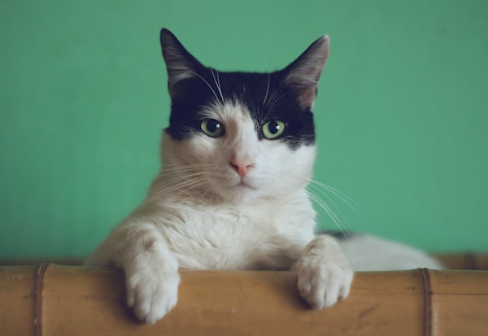

# 🐾 Velvet Paws — Presentation Guide
### Web Application Development — Stage 1 Deliverable

---

## 1. Project Overview

**Company Name:** Velvet Paws  
**Type:** Luxury Pet Shop — Company Profile Web Application  
**Location:** Dubai Marina, UAE  
**Tech Stack:** HTML5 · CSS3 · JavaScript (ES6+) · Node.js · Express · JSON Database  

> *"Where every pet deserves luxury."*

---

## 2. Site Structure (Sitemap)

```
index.html          → Home
├── about.html      → About Us
├── services.html   → Our Services
├── team.html       → Our Team
├── contact.html    → Contact & Comments
└── sitemap.html    → Sitemap + Features List (this deliverable)
        ↓
server.js (Node.js + Express)
        ↓
data/comments.json  (JSON Database)
```

---

## 3. Pages — What Each Page Does

### 🏠 Home (`index.html`)
- Hero section with animated circular badge
- Marquee strip of services
- About snippet, services grid, stats counter, testimonials
- **Pet scroll-reveal** — cat slides up from bottom as user scrolls

```html
<!-- Hero Title -->
<h1 class="hero-title">
  Where Every Pet<br/>Deserves <span>Luxury</span>
</h1>

<!-- Pet reveal at bottom of every page -->
<div class="pet-image-container" id="petImageContainer">
  
</div>
```

---

### 📖 About Us (`about.html`)
- Company origin story (founded 2019, Dubai Marina)
- Mission, Vision, Promise cards
- Core values grid
- **Timeline** of milestones (2019 → 2025)

```html
<!-- Timeline milestone entry -->
<div style="position:absolute; left:-11px; top:0;
     width:20px; height:20px; border-radius:50%;
     background:var(--gold); border:3px solid var(--white);">
</div>
<strong style="color:var(--gold);">2019</strong>
<h4>Grand Opening</h4>
```

---

### 💎 Services (`services.html`)
Four services with pricing:

| Service | Price |
|---|---|
| Luxury Grooming (Basic) | AED 180 |
| Luxury Grooming (Full Spa) | AED 320 |
| Wellness Consultation | AED 150 |
| Behavioural Coaching | AED 200 |
| Supplement Planning | AED 120 |

```html
<!-- Service card with hover border animation -->
<div class="service-card">
  <span class="service-icon">✂️</span>
  <h3>Luxury Grooming</h3>
  <p>Full-service spa grooming with aromatherapy...</p>
</div>
```

---

### 👥 Our Team (`team.html`)
- **2 Founders** — full profile layout with photo + bio
- **6 Staff Cards** — role, certification, specialty
- "Join Our Team" CTA section

```html
<!-- Staff card -->
<div class="team-card">
  <div class="team-img">👩‍⚕️</div>
  <div class="team-body">
    <h3>Dr. Leila Hassan</h3>
    <span class="team-role">Head Veterinary Advisor</span>
    <p>BVSc (Hons), 10 years in companion animal medicine...</p>
  </div>
</div>
```

---

### ✉️ Contact (`contact.html`)
- Booking/enquiry form → saved to **Node.js backend**
- Client **comments wall** loaded dynamically from API
- Leave a comment form → posted to API → appears instantly

```html
<!-- Form submits to Node.js API -->
<form id="contactForm" onsubmit="submitForm(event)">
  <input type="text"  name="name"    placeholder="Your name"  required />
  <input type="email" name="email"   placeholder="your@email.com" required />
  <select name="service">
    <option>Luxury Grooming & Spa</option>
    <option>Wellness Consultation</option>
  </select>
  <textarea name="message" required></textarea>
  <button type="submit" class="btn btn-primary">Send Message 🐾</button>
</form>
```

---

## 4. Brand Design System

### Colour Palette

| Name | Hex | Usage |
|---|---|---|
| Deep Navy | `#1C2B4A` | Navbar, footer, dark sections |
| Burgundy | `#520F23` | Primary brand colour, headings, buttons |
| Soft Blush | `#9C4A6F` | Accents, team photos, gradients |
| Warm Cream | `#F8F4EF` | Page backgrounds, form inputs |
| White | `#FFFFFF` | Cards, clean sections |
| Dark Text | `#3F2A2F` | Body copy |
| Gold Accent | `#D4B37E` | Decorative lines, highlights, logo |

```css
:root {
  --navy:     #1C2B4A;
  --burgundy: #520F23;
  --blush:    #9C4A6F;
  --cream:    #F8F4EF;
  --white:    #FFFFFF;
  --dark:     #3F2A2F;
  --gold:     #D4B37E;
}
```

### Logo Typography — 5 Options
```
Velvet Paws  →  Times New Roman Italic      (default — elegant, classic)
Velvet paws  →  Calibri Body                (modern, clean)
Velvet Paws  →  Arial Nova Italic           (contemporary bold)
Velvet Paws  →  Arial Nova Cond Light Italic (refined, narrow)
Velvet Paws  →  Consolas Italic             (technical, monospace)
```

```css
/* Switch logo font by adding a class */
.logo-text               { font-family: 'Times New Roman', serif; }
.logo-text.calibri       { font-family: 'Calibri', sans-serif; }
.logo-text.arial-nova    { font-family: 'Arial Nova', sans-serif; }
.logo-text.consolas      { font-family: 'Consolas', monospace; }
```

---

## 5. JavaScript Features

### Scroll Reveal (Intersection Observer)
```js
const observer = new IntersectionObserver((entries) => {
  entries.forEach(entry => {
    if (entry.isIntersecting) {
      entry.target.classList.add('visible'); // triggers CSS transition
    }
  });
}, { threshold: 0.12 });

document.querySelectorAll('.reveal, .reveal-left, .reveal-right')
        .forEach(el => observer.observe(el));
```

### Pet Reveal (slides up from bottom)
```js
// Cat image slides up dramatically when section enters viewport
const petObserver = new IntersectionObserver((entries) => {
  entries.forEach(entry => {
    if (entry.isIntersecting) {
      setTimeout(() => {
        petContainer.classList.add('revealed'); // CSS: translateY(0)
      }, 300);
    }
  });
}, { threshold: 0.3 });
```

### Counter Animation
```js
// Numbers count up when scrolled into view: "0 → 2,500+"
function animateCounter(el) {
  const target = 2500;
  const duration = 1800;
  // Ease-out cubic animation using requestAnimationFrame
  function update(now) {
    const progress = Math.min((now - start) / duration, 1);
    const eased = 1 - Math.pow(1 - progress, 3);
    el.textContent = Math.round(eased * target).toLocaleString() + '+';
    if (progress < 1) requestAnimationFrame(update);
  }
  requestAnimationFrame(update);
}
```

---

## 6. Backend — Node.js + Express

### File Structure
```
server.js               ← Express app (exported for Vercel)
data/
  comments.json         ← Seed comments (bundled)
  vp_comments.json      ← Live comments (written at runtime)
  vp_contacts.json      ← Contact enquiries
```

### API Endpoints
```
GET  /api/comments   → returns all comments (newest first)
POST /api/comments   → saves new comment, returns 201
POST /api/contact    → saves booking enquiry, returns 201
```

```js
// GET — fetch all comments
app.get('/api/comments', (req, res) => {
  const comments = JSON.parse(fs.readFileSync(COMMENTS_FILE));
  res.json(comments.reverse()); // newest first
});

// POST — save a new comment
app.post('/api/comments', (req, res) => {
  const { name, pet, rating, comment } = req.body;
  const comments = JSON.parse(fs.readFileSync(COMMENTS_FILE));
  comments.push({ id: Date.now(), name, pet, rating, comment });
  fs.writeFileSync(COMMENTS_FILE, JSON.stringify(comments, null, 2));
  res.status(201).json({ success: true });
});
```

### Frontend fetches data dynamically
```js
// Comments load from API when page opens
async function loadComments() {
  const res = await fetch('/api/comments');
  const comments = await res.json();
  comments.forEach(c => appendCommentToList(c, list));
}

// New comment posted without page reload
async function submitComment(event) {
  event.preventDefault();
  await fetch('/api/comments', {
    method: 'POST',
    headers: { 'Content-Type': 'application/json' },
    body: JSON.stringify({ name, pet, rating, comment })
  });
}
```

---

## 7. Vercel Deployment

```json
// vercel.json — routes API to Express, serves static files from filesystem
{
  "version": 2,
  "builds": [{ "src": "server.js", "use": "@vercel/node" }],
  "routes": [
    { "handle": "filesystem" },
    { "src": "/api/(.*)", "dest": "server.js" },
    { "src": "/(.*)",     "dest": "server.js" }
  ]
}
```

**Deploy command:**
```bash
vercel        # → live URL in ~60 seconds
```

---

## 8. Key Features Summary (Stage 1 ✅)

| # | Feature | Type | Status |
|---|---|---|---|
| 1 | Responsive navbar (sticky + mobile) | Frontend | ✅ |
| 2 | Hero section with animated badge | Frontend | ✅ |
| 3 | Scroll-reveal animations | JS | ✅ |
| 4 | Pet image slide-up on scroll | JS | ✅ |
| 5 | Animated stat counters | JS | ✅ |
| 6 | About Us with milestone timeline | Frontend | ✅ |
| 7 | Services with pricing | Frontend | ✅ |
| 8 | Founders + staff profiles | Frontend | ✅ |
| 9 | Contact & booking form | Frontend + Backend | ✅ |
| 10 | Client comments wall | Frontend + Backend | ✅ |
| 11 | REST API (GET/POST comments) | Node.js | ✅ |
| 12 | JSON file database | Backend | ✅ |
| 13 | Vercel deployment config | DevOps | ✅ |
| 14 | Visual sitemap diagram | Deliverable | ✅ |
| 15 | Fully mobile responsive | CSS | ✅ |

---

## 9. Presentation Talking Points

1. **Why Velvet Paws?** — Identified a gap: Dubai's pet care market lacks a luxury, design-forward brand. Inspired by [Cheshire & Wain](https://www.cheshireandwain.com/collections/luxury-cat-collars).

2. **Design decisions** — Deep Navy + Burgundy palette conveys trust and luxury. Gold accents add premium feel without being garish.

3. **Scroll effects** — The pet reveal at the bottom of every page creates a memorable, fun moment that reinforces the brand personality.

4. **Full-stack integration** — Not just a static site. Comments and enquiries are posted to a live Node.js API and stored in a database — demonstrating client-server communication.

5. **Production-ready** — Deployed on Vercel with proper routing, static asset handling, and environment-aware file paths (`/tmp` on serverless).

6. **Stage 2 plans** — MySQL database, user authentication, online booking calendar, admin dashboard.

---

*Velvet Paws — UOWD Web Development Assignment, Stage 1 · June 2026*
